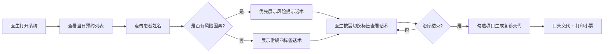

## 1. 产品概述

椅旁话术浮窗系统是为口腔医生在治疗区接诊时设计的桌面端辅助工具，通过非侵入式的浮窗设计，提供标准化话术支持，避免医生临场组织语言，提高沟通效率和医疗质量。

- 核心目标：在不打断医生操作流程的前提下，提供即时、准确的话术支持
- 目标用户：口腔临床医生、护士
- 市场价值：降低沟通失误风险，提升患者体验，统一诊所服务标准

## 2. 核心功能

### 2.1 用户角色

| 角色 | 登录方式 | 核心权限 |
|------|----------|----------|
| 口腔医生 | 工号登录 | 查看预约、使用话术浮窗、生成复诊交代 |
| 护士 | 工号登录 | 协助打印复诊小票、提醒患者 |

### 2.2 功能模块

1. **预约列表页面**：当日预约患者列表，显示基础信息和风险标识
2. **话术浮窗组件**：四标签页话术展示（检查前、拍片前、治疗中、结束交代）
3. **风险提示模块**：根据患者健康档案自动触发禁忌询问话术
4. **复诊交代模板**：勾选项目自动生成口头交代和可打印小票

### 2.3 页面详情

| 页面名称 | 模块名称 | 功能描述 |
|----------|----------|----------|
| 预约列表页 | 患者列表卡片 | 展示当日预约患者姓名、时间、治疗项目、风险标识 |
| 预约列表页 | 日期切换 | 支持查看不同日期的预约列表 |
| 话术浮窗 | 四标签导航 | 检查前/拍片前/治疗中/结束交代四个标签页快速切换 |
| 话术浮窗 | 话术卡片 | 每个标签展示2-3句标准话术，点击可放大查看 |
| 话术浮窗 | 风险提示区 | 患者有特殊病史时顶部优先展示风险话术 |
| 话术浮窗 | 复诊交代面板 | 勾选本次项目和下次安排，自动生成交代内容 |
| 话术浮窗 | 打印功能 | 一键打印复诊交代小票 |

## 3. 核心流程

1. 医生登录系统后，默认展示当日预约患者列表
2. 点击患者姓名卡片，弹出浮动小窗口（不占满全屏）
3. 系统自动检测患者健康档案，如有高血压、糖尿病、孕期或长期服药记录，窗口顶部优先展示风险询问与告知话术
4. 医生可在四个标签页间快速切换，查看各阶段标准话术
5. 治疗结束后，医生勾选本次治疗项目和下次复诊安排，系统自动生成简短口头交代和可打印小票内容

## 4. 用户界面设计

### 4.1 设计风格

- **主色调**：医疗蓝（#2563EB）作为主色，传达专业、信任感
- **辅助色**：警示橙（#F59E0B）用于风险提示，成功绿（#10B981）用于完成状态
- **中性色**：以白色和浅灰为背景，确保内容清晰可读
- **按钮风格**：圆角矩形，微阴影，点击有轻微按压效果
- **字体**：采用"思源黑体"或"微软雅黑"，确保中文显示清晰，字号适中
- **布局风格**：卡片式布局，层次分明，浮窗采用半透明毛玻璃效果
- **图标风格**：线性简约图标，保持医疗行业的专业感

### 4.2 页面设计概述

| 页面名称 | 模块名称 | UI元素 |
|----------|----------|--------|
| 预约列表页 | 顶部导航 | 日期选择器、医生信息、搜索框 |
| 预约列表页 | 患者卡片 | 头像、姓名、预约时间、治疗项目、风险标签、状态标识 |
| 话术浮窗 | 窗口头部 | 患者基本信息、风险标识条（如有）、最小化/关闭按钮 |
| 话术浮窗 | 标签导航 | 四个等宽标签，选中态有下划线动画 |
| 话术浮窗 | 话术内容区 | 大号字体，卡片式展示，每句话术独立卡片 |
| 话术浮窗 | 复诊面板 | 复选框组、项目选择、自动生成的文本预览区 |
| 话术浮窗 | 操作按钮 | 打印、复制、关闭按钮 |

### 4.3 交互设计要点

- **浮窗特性**：窗口可拖拽、可最小化、支持贴边隐藏，始终保持在最上层
- **标签切换**：平滑过渡动画，内容淡入淡出
- **风险提示**：有风险时，顶部警示条以呼吸灯效果吸引注意
- **话术点击**：点击话术卡片有放大效果，方便医生快速阅读
- **响应式**：桌面端优先，支持不同分辨率适配

### 4.4 响应式设计

- 设计优先级：桌面端（1920×1080）> 平板端
- 浮窗尺寸：固定宽度400px，高度自适应，最大高度600px
- 支持窗口拖拽到屏幕任意位置
