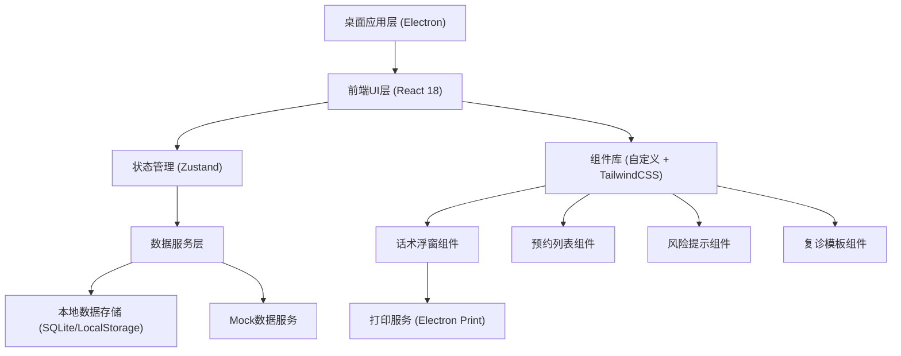
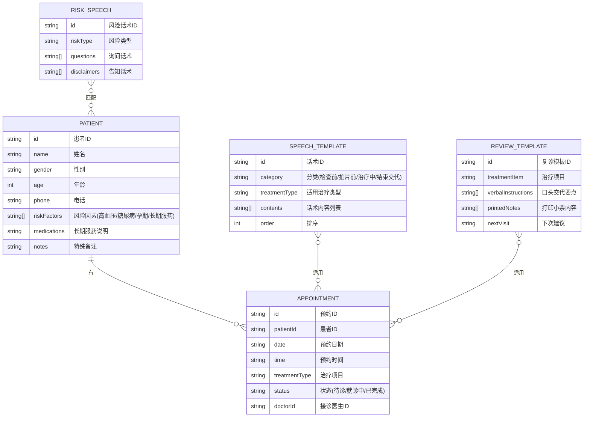

## 1. 架构设计



## 2. 技术描述

- **前端框架**：React 18 + TypeScript
- **构建工具**：Vite 5
- **样式方案**：TailwindCSS 3 + CSS Modules
- **桌面容器**：Electron 28（提供桌面浮窗、系统级打印、窗口管理能力）
- **状态管理**：Zustand（轻量级，适合中小规模应用）
- **数据存储**：LocalStorage（用户配置）+ 内置JSON Mock数据（患者、话术库）
- **图标库**：Lucide React（医疗相关线性图标）
- **动画库**：Framer Motion（流畅的标签切换和浮窗动画）

## 3. 路由定义

| 路由 | 页面/组件 | 功能说明 |
|------|-----------|----------|
| / | 预约列表首页 | 展示当日预约患者列表，主界面 |
| /floating | 话术浮窗 | 独立浮窗路由，可作为子窗口弹出 |

> 注：由于是桌面浮窗应用，话术浮窗将通过 Electron 的 BrowserWindow 作为独立子窗口创建，而非传统路由跳转。

## 4. 数据模型

### 4.1 数据模型定义



### 4.2 Mock数据结构示例

```typescript
// 患者数据
interface Patient {
  id: string;
  name: string;
  gender: '男' | '女';
  age: number;
  riskFactors: ('hypertension' | 'diabetes' | 'pregnancy' | 'longTermMedication')[];
  medications?: string;
  notes?: string;
}

// 预约数据
interface Appointment {
  id: string;
  patientId: string;
  patient: Patient;
  date: string;
  time: string;
  treatmentType: string;
  status: 'pending' | 'in-progress' | 'completed';
}

// 话术模板
interface SpeechTemplate {
  id: string;
  category: 'before-exam' | 'before-xray' | 'during-treatment' | 'post-treatment';
  treatmentType: string;
  contents: string[];
}

// 风险话术
interface RiskSpeech {
  riskType: string;
  questions: string[];
  disclaimers: string[];
}

// 复诊模板
interface ReviewTemplate {
  treatmentItem: string;
  verbalInstructions: string[];
  printedNotes: string[];
  nextVisitOptions: string[];
}
```

## 5. 核心模块说明

### 5.1 浮窗管理模块
- 基于 Electron BrowserWindow 创建独立子窗口
- 支持窗口拖拽、贴边、最小化、始终置顶
- 父子窗口通信（IPC）传递患者数据

### 5.2 话术匹配引擎
- 根据治疗项目类型匹配对应话术模板
- 根据患者风险因素自动注入风险提示话术
- 支持医生自定义话术收藏

### 5.3 复诊生成模块
- 基于勾选的治疗项目组合生成口头交代
- 自动排版打印小票格式（58mm热敏打印机适配）
- 支持打印预览和直接打印

### 5.4 数据层设计
- 所有话术、模板数据内置为 JSON Mock 数据
- 患者预约数据可通过配置接口对接医院HIS系统
- 本地存储用户偏好设置（窗口位置、常用话术等）

## 6. 目录结构

```
├── src/
│   ├── main/                 # Electron 主进程
│   │   ├── main.ts           # 主进程入口
│   │   ├── windowManager.ts  # 窗口管理
│   │   └── printService.ts   # 打印服务
│   ├── renderer/             # React 渲染进程
│   │   ├── components/
│   │   │   ├── AppointmentList/    # 预约列表
│   │   │   ├── FloatingWindow/     # 话术浮窗
│   │   │   ├── RiskAlert/          # 风险提示
│   │   │   ├── SpeechTabs/         # 四标签话术
│   │   │   └── ReviewTemplate/     # 复诊模板
│   │   ├── store/            # Zustand 状态管理
│   │   ├── data/             # Mock 数据
│   │   ├── types/            # TypeScript 类型定义
│   │   └── utils/            # 工具函数
```
